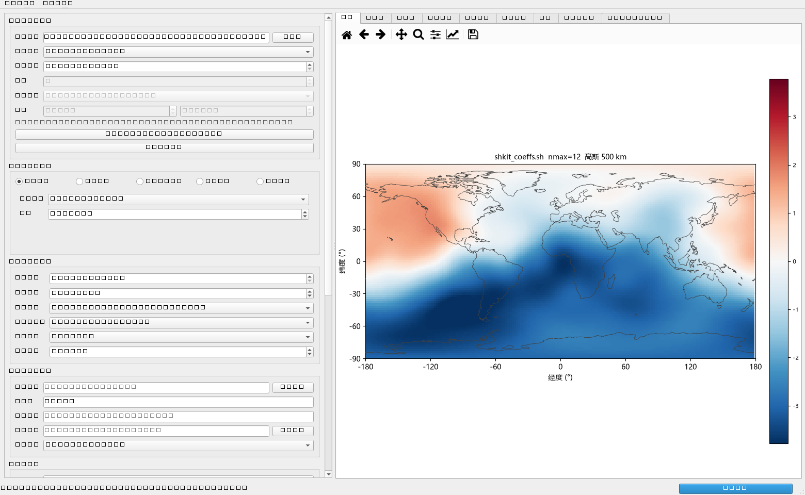
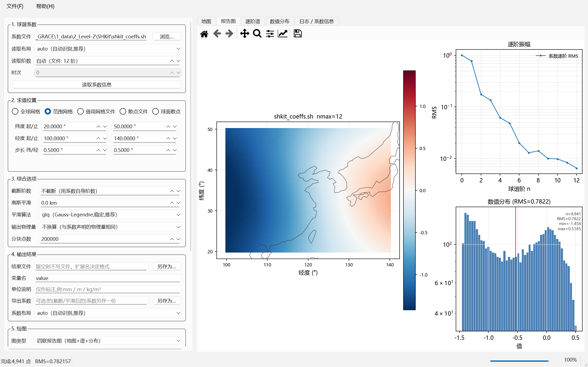

# SHSynth — 球谐系数解算（综合）

[]()
[]()

**输入球谐系数 + 网格或散点位置 → 输出网格或散点值 + 出图。**

SHSynth 只做"系数 → 场"这一个方向（综合 / synthesis），但把这一件事做完整：
**系数格式适配 SHKit 的全部输出**，位置可以是任意规则网格或任意散点，
输出可以直接落成 `nc / grd / csv / txt / npy`，并顺手画出地图、逐阶谱、数值分布和差值图。

- **系数读写**：`triangle` / `gmfcsv` / `gfc` / `npy` / `npz` 五种布局自动识别，读写双向兼容
- **求值位置五选一**：全球网格 / 范围网格 / 借用已有网格文件的格点 / 散点文件 / 球面 Fibonacci 散点
- **物理量与平滑**：高斯平滑（逐阶 `Wₙ`）、geoid / EWH / 面密度 σ / 径向形变 u_r 的**逐阶**换算
- **v2.0**：多时间批量、水平形变 u_N/u_E、FFT 经度快路径、序列产品、动画 GIF
- 纯 Python，核心只依赖 `numpy` / `scipy`

> 与 SHKit 的分工：SHKit 做「散点/网格 → 系数」（分析），SHSynth 做「系数 → 网格/散点」（综合）。
> 两边**逐位一致**：同一套系数、同一批点，本软件的输出与 SHKit 的 `synthesis` 完全相同
> （实测最大差 `0.0`），所有系数文件也是**双向兼容**的。见 `tests/test_vs_shkit.py`。



> 不写代码也可以直接用：打包好的 Windows 桌面版（装完即用，不需要 Python）见
> **[Releases](https://github.com/pengzhenran/SHSynth/releases/latest)**，
> 最新版 `SHSynth_Setup_v2.0.exe`。

---

## 1. 安装与启动

### 1.1 源码环境（开发 / 科研）

本机已验证的开发环境：Anaconda Python 3.13 + numpy 2.1.3 + scipy 1.15.3 +
matplotlib 3.10 + xarray/netCDF4 + PySide6 6.8。

```bash
git clone https://github.com/pengzhenran/SHSynth.git
cd SHSynth

# 必需：numpy / scipy
# 可选：pandas + openpyxl（表格）、xarray + netCDF4（.nc）、matplotlib + PySide6（界面与绘图）
python -m pip install -r requirements.txt        # 或用 pyproject 的 [io,gui,full] 可选组
python -m pip install -e .                       # 需要 shsynth / shsynth-gui 命令时

# 界面（Windows 上最省事：双击）
启动SHSynth.bat                 # 用 pythonw 启动，不弹黑窗口
启动SHSynth-查看报错.bat         # 起不来时用这个，能看到完整报错
python -m shsynth.gui           # 命令行方式
python -m shsynth.gui 系数文件   # 启动时预载某个系数文件

# 命令行
python -m shsynth synth --help
python -m shsynth formats        # 列出支持的全部格式
python -m shsynth.selftest       # 端到端自检（与冻结版同一套）
```

> ⚠️ 与 SHKit 同样的坑：直接敲 `python` 可能是微软商店的占位程序。上面两条 `.bat` 会用 Anaconda 的完整路径启动。

### 1.2 安装版（终端用户，不需要 Python）

下载 [Releases](https://github.com/pengzhenran/SHSynth/releases/latest) 里的
`SHSynth_Setup_v2.0.exe`，双击按向导安装：默认**按用户安装**（不弹管理员）到
`%LOCALAPPDATA%\Programs\SHSynth`，开始菜单生成
`SHSynth 球谐系数解算` / `使用说明 (HTML)` / `作者信息` / `卸载`，可选桌面快捷方式。
包内自带命令行入口：

```bat
SHSynth.exe --cli synth --coeffs model.sh --global-grid 1 --out out.nc --figure out.png
SHSynth.exe --cli info  --coeffs model.sh --spectrum
SHSynth.exe --self-test        自检（52 项关键路径）
SHSynth.exe --version          作者与版本信息
```

### 1.3 自己出安装程序

```powershell
uv venv --python 3.12 D:\SHSynth_build\venv
uv pip install --python D:\SHSynth_build\venv\Scripts\python.exe `
    numpy scipy matplotlib PySide6-Essentials pandas xarray netCDF4 openpyxl pyinstaller
powershell -ExecutionPolicy Bypass -File packaging\build_installer.ps1 -VerifyInstall
```

详见 [`docs/构建方法说明.md`](docs/构建方法说明.md) 与 [`packaging/BUILD_ENV.md`](packaging/BUILD_ENV.md)。

---

## 2. 三分钟上手

### 2.1 命令行：全球 1° 网格 + 报告图

```bash
python -m shsynth synth \
    --coeffs "model.sh" \
    --global-grid 1 \
    --out out/field.nc \
    --figure out/report.png --figure-kind report
```

输出（节选）：

```
系数文件      : …\model.sh
  读取布局    : triangle   (自动识别,适配 SHKit 全部输出格式)
  最高阶      : nmax = 12   独立系数 169
  物理量声明  : 未声明
目标几何      : 规则网格 181 × 360 = 65,160 点
值 范围       : [-4.37786, 1.89921]
   已写出结果    : out\field.nc
   已保存图      : out\report.png
```

### 2.2 命令行：散点（台站 / 航迹）

```bash
# 用某个散点文件的经纬度作为求值点
python -m shsynth synth --coeffs model.sh --points stations.csv --out out/pts.csv

# 不给点位就在全球 Fibonacci 球面上取 5 万点
python -m shsynth synth --coeffs model.sh --sphere-points 50000 --out out/pts.npy
```

### 2.3 命令行：高斯平滑 + 换算成等效水高

```bash
python -m shsynth synth --coeffs model.gfc \
    --global-grid 0.5 --gaussian-km 300 --target-unit ewh \
    --out out/ewh.nc --figure out/ewh.png
```

### 2.4 界面

双击 `启动SHSynth.bat`，然后：

1. **① 球谐系数** → 「浏览…」选系数文件（或直接把文件拖进窗口）；点「读取系数信息」，
   日志里会打印识别出的布局、阶数、时次、物理量；
2. **② 求值位置** → 选「全球网格」并给步长（或范围网格 / 借用网格文件 / 散点文件 / 球面散点）；
3. **③ 综合选项** → 需要的话填截断阶数、高斯半径、输出物理量；
4. **④ 输出结果 / ⑤ 绘图** → 填结果文件与图片路径（留空则只在界面显示）；
5. 点 **开始解算**。右侧页签：**地图 / 报告图 / 逐阶谱 / 数值分布 / 时间序列 / 水平形变 / 动画 / 逐历元诊断 / 日志**。

**v2.0 的批量流程**：① 点『读序列』选一个装着 `GSM-*.gfc` 的目录 → ② 『历元范围』选『整条序列』→
③ 设好求值位置 → ④ 点『综合整条序列』。结果落在『时间序列』『水平形变』『动画』『逐历元诊断』四个页签上；
『动画』页可以播放/暂停/逐帧/调帧率，并一键**导出 GIF**（后台线程渲染，界面不卡）。
1° 全球 203 个历元大约 **0.3 秒**（自动走 FFT 快路径）。



### 2.5 Python API

```python
from shsynth import read_coeffs
from shsynth.engine import synthesis_grid, evaluate
from shsynth.workflow import SynthRequest, run

coeffs = read_coeffs("model.sh")            # 布局自动识别
print(coeffs.summary())

# 只要数值
g = synthesis_grid(lat_vec, lon_vec, coeffs, gaussian_km=300, target_unit="ewh")
v = evaluate(lat_pts, lon_pts, coeffs)

# 或者一条龙：算 + 落盘 + 出图
res = run(SynthRequest(coeffs_path="model.sh", mode="grid",
                       grid_source="global", lat_step=1.0,
                       gaussian_km=300, target_unit="ewh",
                       out_path="out/ewh.nc", figure_kind="report",
                       figure_path="out/report.png"))
print(res.summary)
```

---

## 3. 适配 SHKit 的全部球谐输出格式

SHKit 的 `shkit.io.write_coeffs` 会写出**五种布局**，SHSynth 全部支持，
`layout='auto'` 自动识别（判据比 SHKit 更宽：文件头标记 + 行数 + 容器结构）。

| 布局 | 扩展名 | 判据 | 说明 |
| :--- | :--- | :--- | :--- |
| `triangle` | `.sh .txt .csv .dat .tsv`（+`.gz`） | `#` 头含 `ncoef_triangle`，行数 = `2*(L+1)(L+2)/2` | SHKit 默认；`[C; S]` 堆叠，`m` 外层 / `n` 内层（m2py / gridSHconvert 兼容） |
| `gmfcsv` | `.csv .txt .dat .tsv` | 表头 `n,m,C,S`，行数 = `(L+1)(L+2)/2` | 每行一个系数；多时次写成 `C_t1,S_t1,…` |
| `gfc` | `.gfc`（+`.gz`） | 首列 `gfc` / `gfct` | ICGEM/GFZ 文本；支持 `begin/end` 标记与形式误差列 |
| `npy` | `.npy` | 数组维度 | `(2,L+1,L+1[,ntime])`；也接受 `(L+1,L+1[,ntime])` 与三角 `(2*NC[,ntime])` |
| `npz` | `.npz` | 键名 | `C`/`S`/`meta`（JSON）；也接受 `flat_cs` / `triangle` |

另外还读得动：MATLAB 那种稠密方阵文本、`-180..180` 或 `0..360` 的经度、中文表头、
`# key = value` 头里的 `field_unit` / 高斯半径 / 覆盖率。

**双向兼容**：本软件写出的每一种布局，SHKit 也读得回来（`tests/test_vs_shkit.py` 逐项验证；
唯一的例外是 `gmfcsv` 文本会因 pandas 解析丢最后 1 ulp，而 Python 原生读取逐位无损）。

自检一条命令：

```bash
python -m shsynth selftest
# 解析校验 P̄_10 线性场        : 最大偏差 0.000e+00  -> OK
# 与 scipy 的 4π 归一化对照    : 最大偏差 2.220e-15  -> OK
# 与 SHKit 比对 shkit_coeffs.sh : 系数逐位相同=True  综合最大差=0  -> OK
# …
```

---

## 4. 输入与输出

### 求值位置（五选一）

| 来源 | 命令行 | 说明 |
| :--- | :--- | :--- |
| 全球网格 | `--global-grid 1` | 经度 `0..360` **不含端点**（0 与 360 不重复） |
| 范围网格 | `--lat-min/--lat-max/--lon-min/--lon-max/--lat-step/--lon-step` | 区域或全球，任意矩形 |
| 借用网格文件 | `--grid-file FILE [--grid-var NAME]` | 直接用它已有的格点（支持形式见 §5） |
| 散点 | `--points FILE [--lat-col --lon-col]` | `.csv/.txt/.dat/.tsv/.npy/.xlsx` |
| 球面散点 | `--sphere-points N` | 确定性 Fibonacci 准均匀球面采样 |

界面上的「散点文件」模式会**自动读表头**把「纬度列 / 经度列」填成下拉框：有表头就给列名
（并自动选中识别出的那一列），无表头就给「第1列 / 第2列 …」，第一项始终是「自动（留空）」。

### 结果文件（扩展名决定格式）

- 网格：`.nc`（CF/带元数据）、`.grd`（Surfer ASCII）、`.npy`、`.csv`/`.txt`（三列 `lat,lon,value`）
- 散点：`.csv`/`.txt`/`.dat`/`.tsv`（列序 `lon,lat,value[,value2…]`）、`.npy`

`--out-coeffs FILE` 还能把**处理过的系数**（截断 / 平滑后）按 SHKit 五种布局再导出一份。

### 图（五种）

| `--figure-kind` | 内容 |
| :--- | :--- |
| `report`（默认） | 四联：地图 + 逐阶谱 + 直方图 + 统计标注 |
| `map` | 经纬地图（网格 `pcolormesh` 或散点），可叠加等值线 |
| `spectrum` | 逐阶 RMS 曲线（对数轴） |
| `hist` | 数值分布直方图（带均值 ±1σ） |
| `none` | 不出图 |

PNG / PDF / SVG 都行（按扩展名）。地图书**不需要 cartopy**：海岸线用随包的 Natural Earth 110m
（公有领域），离线可用，换日线处会自动断线（不会出现"飞线"）。

> **地图只画海岸线，不画国界。** 国界数据（即便来自 Natural Earth 这类公开数据）也自带主权划线方式，
> 画上去容易引起不必要的政治争议；海岸线是自然地理要素，没有这个问题。需要国界请自行叠加。

### 聚焦：区域结果不用手动放大

- **默认自动聚焦**：数据只覆盖一块区域时，地图自动缩放到结果范围（跨换日线也能正确处理）；
  覆盖接近全球时照旧画全球。
- 命令行：`--focus auto`（默认）/ `--focus global`（强制全球视图）。
- 界面：勾选框「**自动聚焦到结果范围**」+ 一键按钮「**聚焦结果范围 / 全球视图 切换**」。

---

## 5. 网格文件：到底支持哪些形式

「借用网格文件」（`--grid-file` / 界面上的同名模式）是**按内容识别**的，扩展名不准也能认出来：

| 形式 | 判据（看文件头） | 支持 |
| :--- | :--- | :--- |
| **netCDF** | `CDF` 或 `\x89HDF` | ✅ |
| **netCDF 但叫 .grd** | 同上（GMT 的 `.grd` 其实就是 netCDF） | ✅（会给提示） |
| **Surfer ASCII 网格** | 首行 `DSAA` / `DSBB` | ✅ |
| **Esri ASCII 网格** | 头部 `ncols`/`nrows`/`cellsize` | ✅ |
| **numpy 堆叠** | `.npy`，形状 `(>=3, nlat, nlon)` = `[lon; lat; value]` | ✅ |
| **三列文本** | `.csv/.txt/.dat`，三列 `lat,lon,value` | ✅ |
| Surfer **二进制**网格 | 首行 `DSRB` / `DSI` | ❌ 明确报错并给三条出路 |
| GeoTIFF / 投影坐标网格 | `.tif`、平面米制坐标的 DEM | ❌ 明确报错并给三条出路 |

两个已经修掉的真实故障，值得知道：

1. **Surfer 写 ASCII 网格时会按"每行 10 个数字"折行**（不是一行一个数据行）。旧版按"一行一个数据行"读，
   于是直接失败——这是"试了一些 grd 都不支持"的真正原因。现在把所有数值读成一维流再按 `(nlat, nlon)` 重排，
   折行、不折行、CRLF、UTF-8 BOM 都能读。
2. **平面/投影坐标（米）不能当经纬度用**。旧版会把 `2044500` 当纬度，给出一张位置全错、又不报警的图。
   现在会**明确报错**并说明三条出路（只借数值、先投影成等经纬网格、或在 Surfer 里转换格式）。

### 顺带的两条实用规则

- **经纬度 0..360 含端点**：如果文件里同时有 0 和 360（同一根经线），会自动去重并告诉你 `nlon` 变成了多少；
- **格点太多**：超过 400 万点的网格会提示"借用它的格点会比较久"，建议改用范围网格 + 粗一点的步长。

---

## 6. 物理量：这不是显示选项，是换算

同一张网格的数字可以是水准面高、等效水高、面密度、径向形变，或者一个无量纲场；
它们的球谐系数是**不同的几套数**，而且因子是**逐阶**的：

| 目标 | 由无量纲位系数出发的逐阶因子 | 需要 |
| :--- | :--- | :--- |
| `geoid` 水准面 ΔN | `R`（常数，不逐阶） | — |
| `surface_density` 面密度 σ | `R·ρ̄/3·(2n+1)/(1+k′ₙ)` | `k′` |
| `ewh` 等效水高 | `Aₙ = R·ρ̄/(3ρ_w)·(2n+1)/(1+k′ₙ)` | `k′` |
| `radial_displacement` 径向形变 u_r | `R·h′ₙ/(1+k′ₙ)` | `k′`、`h′` |

`Aₙ` **不是常数**：实测 `A₀ = 1.17e7`、`A₆ = 1.68e8`，6 阶就差 14 倍；重复乘一次 `Aₙ` 会放大 1e7~1e8 倍。所以：

- 系数文件里的 `field_unit` 标签决定"能换算成什么"；
- 标签是 `scalar` / 未声明时，**要 EWH 会直接报错**，并解释为什么不能替你猜；
- 综合时给 `--target-unit` 与"先换算系数再综合"结果**逐位相同**（不会乘两次）。

载荷勒夫数表随包提供（`data/load_love_numbers.npz`，PREM / Wang 2012，`k′₁` 含 CE→CF 改正），
与 SHKit 的表逐值一致。物理量标签**大小写不敏感**（`EWH` / `ewh` / `等效水高` 都认）；
`--target-unit 不换算`（以及 `none`/`无`）表示"什么都不换算"，会原样输出。

---

## 7. v2.0 新增

| 新增 | 一句话 | 实测 |
| :--- | :--- | :--- |
| **时间轴** `shsynth.timeaxis` | 系数/场知道自己对应哪一天（文件名三规则 + gfc 头）；缺测/重复只报告 | 203 个真实 gfc 对 legacy `*_TimeInfo.dat` 最大偏差 **4.6e-07**（≤1e-6） |
| **序列读取** `series-read` | 一个 `GSM-*.gfc` 目录 → 带日期的 `(L+1,L+1,N)` 序列；混入 GAC/GAD 报错 | 203 个文件 **0.5 s** 读完 |
| **序列落盘** `series_nc` / `series_dat` | `.nc(time,n,m)` 与 SHKit 对齐；legacy 三角 `.dat` 双向 | 往返**逐位**一致 |
| **写盘带时间坐标** | `write_grid(times=)` / `read_grid(with_time=True)`：修掉"写出即丢日期" | 写→读日期逐值一致 |
| **批量综合** `series-synth` | 整条序列一次算完；可疑历元 MAD 离群**只报告不剔除** | 一次算完 ≡ 逐历元循环（≤1e-12） |
| **FFT 经度快路径** | 整圈均匀经度上把逐点经度展开换成一次 FFT；不满足自动回退并说明 | 1°×203 历元 **~10 s → 0.30 s**；与直接法逐点相对 1e-14 |
| **水平形变 u_N / u_E** | 球面梯度算子，矢量 = 北/东/大小/方位角 | 解析锚点 `C₂₁` 偏差 **0.0**；极点 `u_E = −√3` 精确；直接 ≡ FFT 7e-15 |
| **趋势 / 周年场** `series-fit` | 在**系数域**拟合（线性算子与空间基可交换） | 与场域逐点拟合一致到 **1e-15** |
| **区域平均** `series-basin` | 流域/区域平均时间序列；两种口径都算并对比 | 同网格下两口径**代数恒等**（6e-16…5e-15）；`coeff` 比 `spatial` 快 **48×** |
| **去均值三口径** | **GRACE 惯例（2004–2010 平均）/ 全时段 / 自定义时段** | 三种口径的 EWH 差最大 **848 mm**、RMS 65 mm |
| **动画 / GIF** | `series-synth --anim-out`；界面新增『动画』页 | 帧数 = 历元数；同一输入两次导出**逐字节一致** |
| **界面** | 时间轴控件 + 历元范围 + 批量序列 + 去均值口径 + 四个新页签 | 离屏冒烟 **241 项**全绿 |

**一处必须知道的 legacy 坑**（软件会打印实际窗口，但**不会替你改数**）：
legacy 脚本里的 `dur_mascon` 与它自己的注释对不上——`read_GRACE_SH_preprocess_postprocess_SH60.m`
写着 `%% remove the mean of 2004-2010` 却用 `dur_mascon = 90:150`，在 CSR RL06（203 历元）上实测落到
**2009-12..2016-01**（差 6 年）。所以 v2.0 **按日期**定口径；要复制 `19:90` 请用
`--remove-mean-mode custom --mean-from 2004-01-01 --mean-to 2009-12-31`。

---

## 8. 命令行一览

```bash
python -m shsynth synth    --coeffs FILE [位置] [选项] [输出] [出图]   # 主功能
python -m shsynth info     --coeffs FILE [--spectrum] [--unit-table]    # 看系数
python -m shsynth convert  --coeffs FILE --out FILE [--to-unit ewh]     # 换布局/换物理量
python -m shsynth formats                                              # 列格式
python -m shsynth selftest [--shkit DIR]                               # 自检
# ---- v2.0：多时间批量 / 水平形变 / 动画 ----
python -m shsynth series-read   --indir DIR --out SEQ.nc                # gfc 目录 → 带日期的序列
python -m shsynth series-synth  --coeffs SEQ [位置] [--anim-out A.gif]  # 批量综合（+ 动图）
python -m shsynth series-points --coeffs SEQ --points P.csv --out OUT   # 站点时间序列
python -m shsynth series-fit    --coeffs SEQ --out-trend T.nc           # 趋势 + 周年
python -m shsynth series-basin  --coeffs SEQ --mask M --out B.csv       # 区域平均（两种口径）
python -m shsynth --help
```

常用选项：

```
--layout auto|triangle|gmfcsv|matrix|gfc|npy|npz   系数文件布局（默认自动识别）
--nmax N              截断到 N 阶          --time K       多时次取第 K 个
--gaussian-km KM      高斯平滑半径（综合时施加，不改系数文件）
--target-unit UNIT    输出物理量（不换算 / geoid / ewh / surface_density /
                      radial_displacement，也接受中文：等效水高、水准面、面密度、径向形变）
--chunk N             每块点数（内存控制）
--quiet               只打印一行结果
```

---

## 9. 验证

```bash
python tests/run_all.py            # 9 套 763 项，一次跑完并汇总（约 50 秒）
python tests/run_all.py --fast     # 跳过界面与跨软件比对
```

| 套件 | 项数 | 内容 |
| :--- | ---: | :--- |
| `test_formats.py` | 97 | SHKit 全部布局的读写、自动识别、往返、错误路径 |
| `test_engine.py` | 39 | 解析解、scipy 对照、4π 正交性、**全球平均 = C₀₀**、分块/多时次/截断 |
| `test_units_filters.py` | 65 | 逐阶因子与手算核对、换算往返、防重复换算、守卫报错 |
| `test_gridfiles.py` | 49 | Surfer 折行/内容判型/平面坐标拒绝/聚焦/列识别/海岸线 |
| `test_workflow_cli.py` | 84 | 流程与各输出格式、选项传递、绘图、命令行退出码 |
| `test_multitime.py` | 165 | **v2.0**：时间轴口径、序列读写、批量综合、FFT 快路径、水平形变、区域平均两口径 |
| `test_packaging.py` | 15 | 打包脚本静默陷阱：**BOM**、Inno 的 `Filename` 引号约定、含空格路径安装校验 |
| `test_vs_shkit.py` | 8 | **与 SHKit 逐位比对**（读取/综合/高斯/换算/双向兼容） |
| `test_gui_smoke.py` | 241 | 界面离屏冒烟（控件、后台线程、聚焦、列下拉框、渲染、**动画页与 GIF 导出**、截图） |

关键实测数字：

| 项目 | 结果 |
| :--- | :--- |
| 与 SHKit 读取系数 | **逐位相同**（`np.array_equal`） |
| 与 SHKit 综合结果（随机点/网格） | **最大差 0.0** |
| 与 SHKit 高斯滤波系数（100–3000 km） | **逐位相同** |
| 与 SHKit 物理量换算（4 种量） | **逐位相同** |
| 解析解 `C₁₀ = 1/√3 → sinφ` | 偏差 < 1e-14 |
| 与 scipy 勒让德函数对照 | 最大偏差 4.3e-14 |
| 4π 归一化正交性（所有 (n,m)） | 相对偏差 5.3e-14 |
| 全球加权平均 vs `C₀₀` | 0.5° 时 5.2e-8，误差按 O(Δφ²) 收敛（比值 4.00） |
| 批量一次算完 ≡ 逐历元循环 | ≤1e-12 |
| FFT 经度路径 ≡ 直接法 | 相对 1e-14；1°×203 历元 **~10 s → 0.30 s** |
| 区域平均两口径（同一套格点） | **代数恒等**，相对差 6e-16…5e-15；`coeff` 比 `spatial` **快 48×** |
| 动画导出 | 帧数 = 历元数；同一输入两次导出**逐字节一致** |
| 去均值 `all` 与旧 `remove_mean` | **逐位一致**（换实现也不能动数） |
| 去均值 `grace`（2004–2010） | 精确命中窗口（84/203）；窗口外历元对结果**零影响** |
| 去均值 `grace` vs `all`（EWH） | 最大 **848 mm** / RMS 65 mm（与信号同量级） |

---

## 10. 目录结构

```
SHSynth/
├─ shsynth/
│  ├─ coeffs.py        SHCoeffs 容器（4π 归一化、无 CS 相位、三角布局）
│  ├─ coeffio.py       **全部 SHKit 系数格式**的读写与识别
│  ├─ engine.py        勒让德递推 + 综合（任意点/网格、分块、多时次）
│  ├─ filters.py       高斯平滑（glq / frc）
│  ├─ units.py         物理量标签与逐阶换算（geoid/σ/EWH/u_r）
│  ├─ lovenumbers.py   载荷勒夫数 h′/l′/k′
│  ├─ fieldio.py       散点与网格文件读写（nc/grd/csv/txt/npy）+ HDF5 网络盘兼容层
│  ├─ targets.py       求值位置解析（网格/网格文件/散点/球面点）
│  ├─ plotting.py      matplotlib 绘图（地图+离线海岸线/谱/直方图/报告图）
│  ├─ workflow.py      一站式流程（读系数→综合→落盘→出图→汇总）
│  ├─ series.py        多时间序列与非 FFT 路径
│  ├─ timeaxis.py      时间轴
│  ├─ cli.py           命令行
│  ├─ selftest.py      端到端自检（冻结版 exe 也跑这一套）
│  ├─ author.py        作者/单位/联系方式/公众号二维码（单一定义处）
│  ├─ gui/             PySide6 界面（app / canvases / workers）
│  └─ data/            载荷勒夫数表 + 离线海岸线 + 公众号二维码
├─ tests/              9 套测试 + run_all.py
├─ docs/               使用说明（含 HTML 版）、发行说明、构建方法说明、
│                      命令与参数、物理量与换算、许可与第三方组件、界面截图
├─ examples/           demo_workflow.py（端到端七场景演示）
├─ tools/              check_licensing.py、check_docs_ready.py、make_icon.py、make_help_html.py
├─ licenses/           LGPL-3.0 / GPL-3.0 / NOTICE（第三方组件声明）
├─ packaging/          PyInstaller spec + Inno Setup 脚本 + 一键打包脚本 + BUILD_ENV.md
├─ SHSynth.ico         程序图标
├─ LICENSE.txt         本软件自身的 MIT 许可
├─ out/                默认输出目录（仓库里带了一份演示输出）
├─ 启动SHSynth.bat       双击启动界面
└─ 启动SHSynth-查看报错.bat
```

### 文档一览

| 文档 | 内容 |
| :--- | :--- |
| [`README.md`](README.md) | 总览、安装、格式表、验证数字 |
| [`docs/使用说明.md`](docs/使用说明.md) | 界面与命令行怎么用（随仓库还有 HTML 版 `docs/使用说明.html`） |
| [`docs/发行说明.md`](docs/发行说明.md) | v2.0 新增 + v1.0 功能、验证结果、已知限制、许可与致谢 |
| [`docs/多时间数据批量处理方案.md`](docs/多时间数据批量处理方案.md) | **v2.0 规划稿**：多时间批量 / 水平形变 / FFT 经度快路径（含实测数字与复现脚本） |
| [`docs/命令与参数.md`](docs/命令与参数.md) | 全部命令、参数、输入识别规则 |
| [`docs/物理量与换算.md`](docs/物理量与换算.md) | 逐阶因子 `Aₙ` / geoid / σ / EWH / u_r 的公式与实测值 |
| [`docs/构建方法说明.md`](docs/构建方法说明.md) | 怎么从源码出安装程序（极简环境、图标、说明书、打包、踩坑） |
| [`docs/许可与第三方组件.md`](docs/许可与第三方组件.md) | LGPLv3 义务与闭源合规做法 |
| [`packaging/BUILD_ENV.md`](packaging/BUILD_ENV.md) | 打包环境速查 |

---

## 11. 已知限制与环境注意

1. **HDF5 在网络盘上可能打不开 netCDF。** 实测华为家庭存储映射盘上，`xr.open_dataset` 连已存在的 `.nc`
   都会报 `FileNotFoundError`（HDF5 的已知限制，普通文件 I/O 完全正常）。SHSynth 已内置兼容层：
   读写 `.nc` 失败时自动改用本机临时文件中转，结果不受影响，并在警告里说明。
2. **`--global-grid` 的经度不含 360**，`0,1,…,359`；范围网格则可以显式给到 360。
3. **`.gfc` 一个文件只装一个时次**：多时次对象要写 `.gfc` 必须用 `--time K` 指定，
   否则报错（而不是悄悄拼出一个读回来就坏的文件）。
4. **散点文本默认 10 位有效数字**（与 SHKit 一致），需要更多位请用 `.npy` 或 `.nc`。
5. 只做**综合**。要做「散点/网格 → 系数」的分析，用 SHKit。
6. **MP4 需要额外依赖**。`.gif` 只用 Pillow（装 SHSynth 时已带上）；
   `.mp4`/`.webm` 需要 `imageio` + `imageio-ffmpeg`（还要有 ffmpeg 可执行文件）。
   没装时**明确报错并建议改用 `.gif`**，不会把视频悄悄降级成一张静止图。
7. **区域平均的两个口径不是两个答案**。`method='coeff'`（掩膜球谐核）与 `method='spatial'`（网格面积加权）
   在**同一套格点**下是**代数恒等**的（实测相对差 6e-16…5e-15），`coeff` 的价值是**算得快**（实测 48×）。

---

## 12. 许可与出处

本软件代码：**MIT**（[`LICENSE.txt`](LICENSE.txt)）。

- 球谐约定（4π 归一化、无 Condon–Shortley 相位）、勒让德递推、高斯滤波公式、载荷勒夫数表、
  离线海岸线均与 SHKit / `m2py`（gridSHconvert）保持一致，以保证两边结果**逐位**可比；
- 界面使用 **PySide6-Essentials**（LGPLv3，动态链接、未修改）与 **matplotlib**（BSD 风格）。
  **刻意不使用** GPL-only 的 Qt Charts / Qt Data Visualization——一旦用上，闭源分发就不可能了；
- 海岸线/国界为 Natural Earth 110m（公有领域），随包提供，离线可用。

闭源商用前的自查：

```bash
python tools/check_licensing.py
# 通过：未检测到 GPL-only 模块 -> 当前环境可用于闭源分发
```

第三方组件清单见 `licenses/NOTICE.txt`，合规做法见 [`docs/许可与第三方组件.md`](docs/许可与第三方组件.md)。

## 13. 相关项目

- SHKit（分析方向，与 SHSynth 逐位一致、系数文件双向兼容）：<https://github.com/pengzhenran/SHKit>

## 14. 反馈

作者：彭桢燃（Zhenran Peng），中国地质大学（武汉）　邮箱：zhenran.peng@cug.edu.cn
课题组公众号「地球重力与人类生活（TVGG）」

使用中遇到问题、发现异常结果，或希望增加新功能，欢迎提交
[Issue](https://github.com/pengzhenran/SHSynth/issues) 或邮件反馈。

## 关注与获取

| 课题组公众号「地球重力与人类生活（TVGG）」 | 夸克网盘（Windows 安装包，国内下载更快） |
| :---: | :---: |
|  |  |
| 扫码关注，获取工具与更新 | 扫码打开网盘分享（`SHSynth_Setup_v2.0.exe`） |
