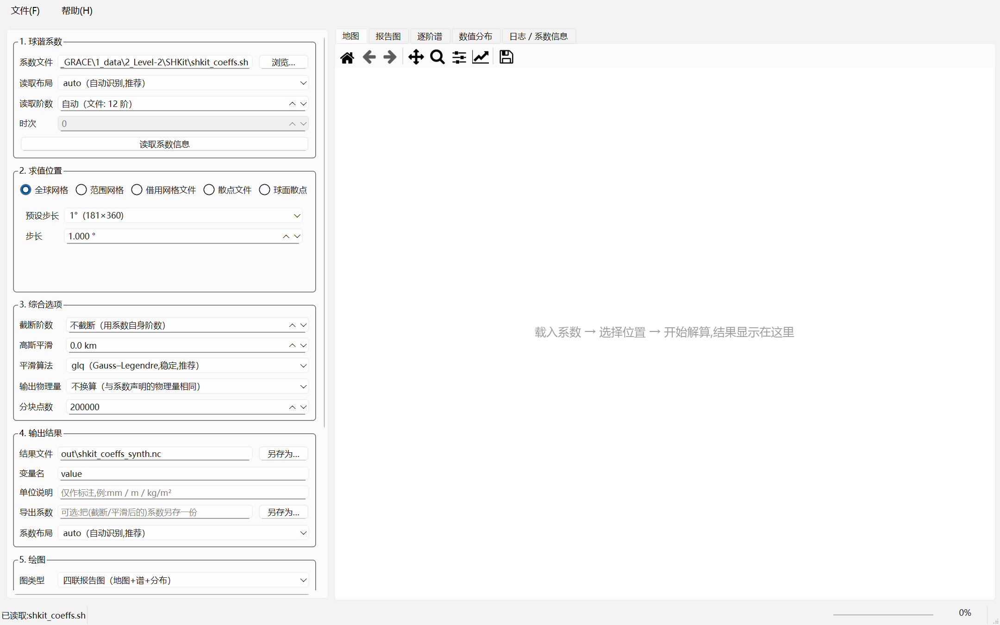
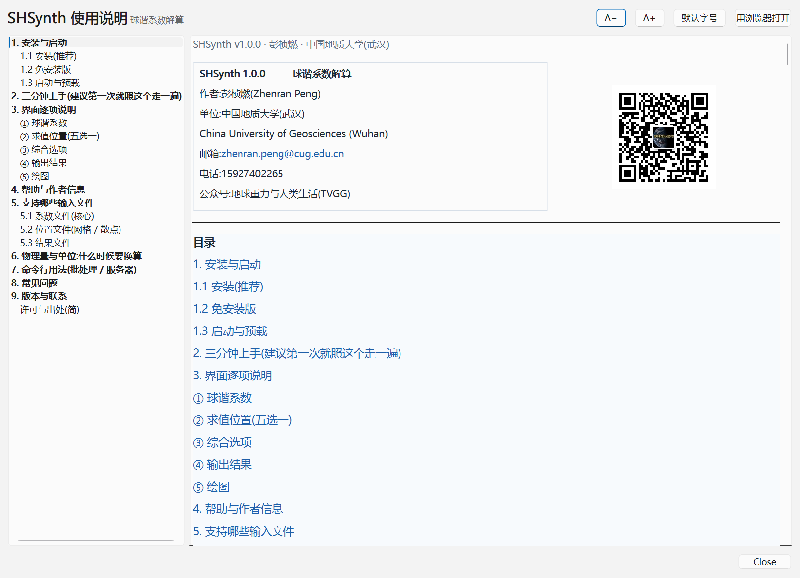
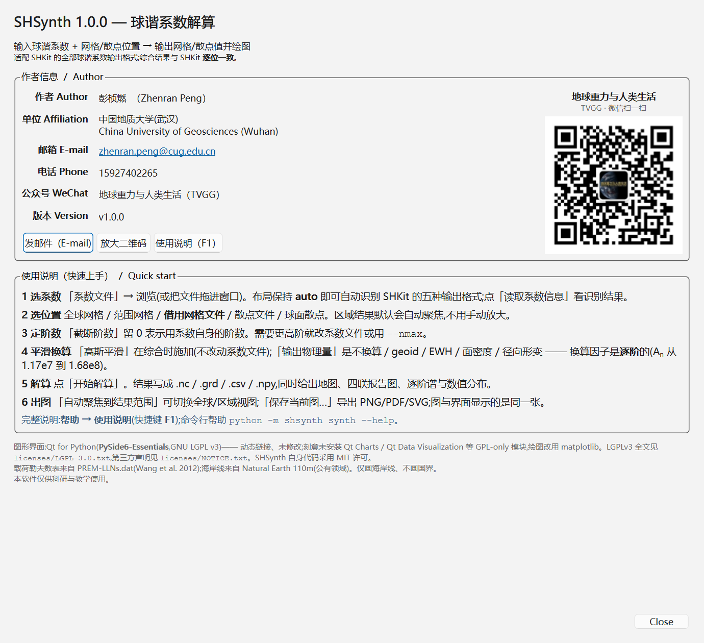

# SHSynth 使用说明

**SHSynth — 球谐系数解算(综合)**

| | |
| --- | --- |
| 软件 | SHSynth v2.0 —— 球谐系数解算(综合) |
| 用途 | 输入球谐系数 + 网格或散点位置 → 输出网格或散点值 + 出图 |
| 作者 | 彭桢燃(Zhenran Peng),中国地质大学(武汉) |
| 邮箱 | <zhenran.peng@cug.edu.cn> |
| 电话 | 15927402265 |
| 公众号 | 地球重力与人类生活(TVGG) |
| 许可 | 本软件代码 MIT 许可;仅供科研与教学使用 |

> **一句话**:给它一套球谐系数 + 你想看的位置(全球网格、某个区域、或者一堆散点),
> 它把系数算成那些位置上的值,写出文件并画成图。
>
> 系数文件**不用挑格式**:它认得 SHKit 的五种输出格式(也认得同族的
> `m2py` / `gridSHconvert` 三角格式),打开就能读。

---

## 1. 安装与启动

### 1.1 安装(推荐)

双击 **`SHSynth_Setup_v2.0.exe`**,按向导点下一步即可。

* **不需要安装 Python**,也不用联网:运行所需的一切都在安装包里;
* 默认**按当前用户安装**(不弹管理员授权),装在
  `%LOCALAPPDATA%\Programs\SHSynth`;
* 安装向导里可以勾选"创建桌面快捷方式";
* 装完后:开始菜单 → `SHSynth` → 有四个入口:
  **SHSynth 球谐系数解算** / **使用说明 (HTML)** / **作者信息** / **卸载 SHSynth**。

### 1.2 免安装版

解压 `SHSynth_v2.0.zip` 到任意目录(建议路径里不要有空格),双击 `SHSynth.exe`。

### 1.3 启动与预载

* 双击 `SHSynth.exe` 或桌面快捷方式;
* 也可以**把系数文件拖进窗口**,或者用命令行带文件启动:

```bat
SHSynth.exe D:\data\model.sh
```

启动后的界面分左右两部分:左边是**参数面板**(五组,按顺序填),
右边是**结果页签**(地图 / 报告图 / 逐阶谱 / 数值分布 / 日志)。



---

## 2. 三分钟上手(建议第一次就照这个走一遍)

1. **① 球谐系数** → 点「浏览…」选一个系数文件(或直接把文件拖进窗口)。
   布局保持 **auto** 就行;点「读取系数信息」,日志里会打印识别结果。
2. **② 求值位置** → 选「全球网格」,步长先用 **2°**(快)。
3. **③ 综合选项** → 先什么都不改。
4. **④ 输出结果** → 结果文件填 `out\field.nc`(或 `.grd` / `.npy` / `.csv`)。
5. **⑤ 绘图** → 图类型选「四联报告图」,图片文件填 `out\report.png`。
6. 点 **开始解算**。等进度条走完,右侧「报告图」页签里就是结果;
   「日志 / 系数信息」页签里有完整的文字汇总(点数、值范围、RMS、警告)。

想少走一步:界面上任一「浏览…」都能打开资源管理器,拖放文件也可以。

---

## 3. 界面逐项说明

### ① 球谐系数

| 控件 | 怎么填 |
| --- | --- |
| **系数文件** | 你要解的系数文件。支持 `.sh .txt .csv .dat .tsv .gfc .npy .npz`(文本和 gfc 还支持 `.gz` 压缩),详见 [第 5 节](#5-支持哪些输入文件) |
| **读取布局** | 保持 **auto(自动识别,推荐)**。只有在自动判断错了、而且你确定它是什么格式时才手动指定 |
| **读取阶数** | 0 = 用文件自身的最高阶。想让结果更平滑可以先填一个小一点的阶数(等效于"截断") |
| **时次** | 系数文件里若有多个时次(例如 GRACE 的逐月模型),这里选第几个。只有一个时次时此项灰掉不可用 |
| **读序列(目录/清单 → 带日期的序列)** | **v2.0**。选一个装着 `GSM-*.gfc` 的**目录**(或 `.txt` 清单),一次读成**带真实日期**的系数序列。日期优先取 gfc 头,头里没有就退回文件名 |
| **历元范围** | **v2.0**。`只用当前时次`(与 v1.0 完全一致)/ `整条序列(批量综合)` / `按起止时次批量`。下面会显示时间轴摘要(跨度、间隔、缺测、重复) |
| **读取系数信息** | 立刻读一遍文件,在日志里打印:识别出的布局、最高阶、时次数、物理量标签、时间轴摘要、以及任何警告。**建议每次先点一下** |

> **v2.0 的批量流程**:① 点『读序列』选 gfc 目录 → ② 『历元范围』选『整条序列』
> → ③ 设好求值位置 → ④ 点『**综合整条序列**』。
> 结果会出现在新增的『**时间序列**』『**水平形变**』『**动画**』『**逐历元诊断**』四个页签上。
> 1° 全球 203 个历元大约 **0.3 秒**(自动走 FFT 快路径)。

> ⚠️ **先看"日志"页签里的警告再信数字。** 例如"文件头写的阶数和行数不一致"
> 这类信息只在这里出现。

### ② 求值位置(五选一)

| 选项 | 说明 | 什么时候用 |
| --- | --- | --- |
| **全球网格** | 给一个步长(预设 0.5°/1°/2°/2.5°/5°,也可以自己填)。纬度 -90..90,经度 0..360(**不含端点**,不会重复首尾经线) | 想在全球尺度上看一张完整地图 |
| **范围网格** | 自己填纬度起止、经度起止、步长 | 只关心某个区域(例如东亚 5–55N / 60–140E),这样又快又省内存 |
| **借用网格文件** | 用它**已有的格点**作为求值位置 | 想把自己的结果和某个现成网格**逐格点直接对比**(差值图)时 |
| **散点文件** | 用文件里的经纬度作为求值点(不需要该文件有数值列) | 台站、航迹、验潮站等不规则点位 |
| **球面散点** | 不给点位,在全球球面上均匀取 N 个点(Fibonacci 采样) | 只要一个统计意义上的全球抽样,不要规则网格 |

**散点文件的列怎么指定**:选好文件后,「纬度列 / 经度列」会**自动读表头**变成下拉框:

* 有表头 → 显示列名(例如 `latitude(第 3 列)`),并**自动选中**软件判断出的那一列;
* 无表头 → 显示 `第1列`、`第2列`…;
* 第一项永远是 **「自动(留空)」** —— 想完全交给软件判断就选它;
* 下方会显示一行提示:几列、有没有表头、多少行、哪一列不是数值(例如台站名)。

> 文件里夹着台站名之类的**文本列**不影响读取,那一列会被忽略并给一条警告。

### ③ 综合选项

| 控件 | 说明 |
| --- | --- |
| **截断阶数** | 只用前 N 阶(0 = 全部)。系数阶数高、噪声大,或者只想看长波时用 |
| **高斯平滑** | 平滑半径(km)。**在计算时施加,不会改动你的系数文件**。半径要和阶数匹配才有意义:同样 300 km,12 阶的场几乎看不出变化,而 60 阶会被压掉不少;3000 km 会把细节基本抹平 |
| **平滑算法** | `glq`(Gauss–Legendre 求积,稳定,**推荐**)/ `frc`(经典递推,快,大半径时精度差) |
| **输出物理量** | 不换算(默认)/ 水准面高 / 等效水高 EWH / 面密度 / 径向形变 / **水平形变 u_h**。**这是换算,不是显示选项** —— 见 [第 6 节](#6-物理量与单位什么时候要换算) |
| **输出分量** | **v2.0**。`标量场`(默认)/ `水平形变·北分量 u_N` / `水平形变·东分量 u_E` / `水平形变·北+东(矢量)`。选水平形变时会自动把『输出物理量』切到水平形变 —— 两者的逐阶因子不同(水平是 `R·l′ₙ/(1+k′ₙ)`),混用会差好几个数量级 |
| **分块点数** | 内存控制。默认 20 万点/块;几百万点也不需要改。内存紧张时调小(不影响结果) |

### ④ 输出结果

| 控件 | 说明 |
| --- | --- |
| **结果文件** | 要写出的结果。**扩展名决定格式**:网格用 `.nc` / `.grd` / `.npy` / `.csv` / `.txt`;散点用 `.csv` / `.txt` / `.dat` / `.tsv` / `.npy`。留空则不写文件 |
| **变量名** | 写 netCDF 时的变量名(默认 `value`) |
| **单位说明** | 只是写进文件/图上的说明文字(例如 `mm`、`m EWH`),**不做任何换算** |
| **导出系数** | 可选:把(截断/平滑后的)系数**另存一份**,布局可选 `triangle` / `gmfcsv` / `gfc` / `npy` / `npz` |
| **系数布局** | 上一条用的布局。要交回旧软件用 `triangle`;要给别人通用的用 `gfc` |

### ⑥ 批量序列(v2.0)

| 控件 | 说明 |
| --- | --- |
| **场序列输出** | 整条序列的结果写到哪里。`.nc` 会带**真实时间坐标**(不是只有一叠没有日期的图);矢量模式下一个文件里装 `north_displacement` / `east_displacement` 两个变量。留空则只在界面显示 |
| **诊断表输出** | 逐历元诊断 `.csv`:每行一个历元,含日期、点数、有限比例、min/max/mean/RMS、缺测间隔、警告数 |
| **去均值** | **三选一(v2.0)**:`不去均值(原始场)`(默认)/ **`GRACE 惯例(2004-01-01..2010-12-31 平均)`** / `全时段平均` / `自定义时段…`。GRACE 的 `GSM` 文件装的是**完整静态重力场**(`C₀₀=1`、`C₂₀≈−4.8e-4`),不做去均值换成 EWH 会得到几万米的常量场而不是水。实测:不去 → 逐历元 RMS 53 828 m;去掉 → 38–153 mm |
| **自定义时段** | 选『自定义时段…』时启用。写法很宽松:`2004-01-01` / `2004-01` / `2004` / `2004.5` 都认;**只填一边也行**(起点补 01-01,终点补 **12-31**)。下面那行会**实时算出**这次会用哪一段:"→ 将用 84/96 个历元(2004-01-15 .. 2010-12-15,占 88%)做基准" |
| **综合整条序列** | 按『历元范围』选的历元批量综合。规则整圈经度网格自动走 FFT 快路径;散点/区域网格走直接法,日志里会写明走了哪条路 |

> **为什么去均值要选而不是勾一下**:它决定了整个异常场的**静态基准**。
> GRACE 惯例(2004–2010 平均)与全时段平均算出来的参考场**不是一回事** ——
> 实测在真实 CSR 序列上,两者的 `C₀₀` 参考值差 1.3e-10(静态场量级 ~1),
> 换成 EWH 就是几厘米量级的系统差。所以程序**不替你选**,而且会把实际用了
> 哪一段历元打印出来。窗口里一个历元都没有时**直接报错**,绝不悄悄退化成全时段。

> ⚠️ **你 legacy 脚本里的 `dur_mascon` 和它的注释对不上。**
> `3_processed/read_GRACE_SH_preprocess_postprocess_SH60.m` 里写的是
> `%% remove the mean of 2004-2010` 配 `dur_mascon = 90:150`,但在 CSR RL06
> (203 历元)上 `90:150` 实际落到 **2009-12..2016-01** —— 拿它跑 RL06 会
> **静默地**用 2009–2016 当基准。同位置 GRACE-FO 版用的是 `19:90`,对应
> 2004-01..2009-12。所以本软件按**日期**定口径;要精确复刻 `19:90` 就选
> 『自定义时段』填 `2004-01-01` .. `2009-12-31`。

右侧页签(v2.0 新增四个):

* **时间序列** —— 网格给面积加权平均 + 逐历元最小/最大;**N 曲线**横轴是十进制年;
* **水平形变** —— 大小底图(`viridis`)+ 位移箭头(`quiver`,自动抽稀;极点不画箭头);
* **动画** —— 把整条序列当动图放。控制条:`▶ 播放 / ⏸ 暂停`、`◀ ▶` 单步、
  拖动滑条定位到某一历元、`帧率`(0.2–60 fps)、`循环`、`导出 GIF…`。
  角标显示 `第几帧 / 共几帧` + 日期;在『逐历元诊断』里点某一行,
  动画页也会跟着跳到那一历元(同一件事在两页保持一致)。
* **逐历元诊断** —— 表格;可疑历元(MAD 稳健离群)高亮,**只报告不剔除**;点某一行跳到该历元的地图。

> **动画的配色是固定的**:颜色范围取**整段序列**的稳健对称范围,**不逐帧定标**。
> 逐帧各自定标的话,动画会随每历元的极值"闪",眼睛看到的"变化"其实是配色在变。
> 实际用的范围会写进日志,导出时也会回报。
> 导出走后台线程,渲染期间界面不卡;`.gif` 只需要 Pillow(装 SHSynth 时已带上);
> `.mp4` 需要额外装 `imageio` + `imageio-ffmpeg`,**没装会明确报错并让你改用 GIF**,
> 不会把视频悄悄降级成一张静止图。

### ⑦ 绘图

| 控件 | 说明 |
| --- | --- |
| **图类型** | 四联报告图(默认:地图+逐阶谱+直方图+统计)/ 地图 / 逐阶谱 / 数值分布 / 不出图 |
| **图片文件** | 留空则只在界面显示;填了就同时存盘(按扩展名 PNG / PDF / SVG / JPG) |
| **DPI** | 出图分辨率,期刊插图建议 ≥ 300 |
| **配色** | 正负异常用发散色系(如 `RdBu_r`)最直观;全是正值可换 `viridis` |
| **叠加等值线** | 网格图上加等值线,报告图里更适合讲解 |
| **画海岸线** | 默认开。地图**只画海岸线,不画国界**(见下) |
| **配色关于 0 对称** | 异常场保持勾选;若你的场全是正值,取消勾选能让色阶铺满 |
| **自动聚焦到结果范围** | **默认勾选**:区域结果自动缩放到数据范围,不会在全球视角下变成一小块 |
| **聚焦 / 全球视图 切换** | 一键在两种视图之间来回切,立刻重画(不用手动框选放大) |

> **为什么地图上没有国界?** 这是有意的:国界数据自带主权划线方式,画在地图上容易
> 引起不必要的政治争议;海岸线是自然地理要素,没有这个问题。
> 需要国界请在你自己的后处理里叠加。

右侧页签:

* **地图** —— 网格 `pcolormesh` 或散点图;
* **报告图** —— 四联图(地图 + 逐阶谱 + 数值分布 + 统计标注),适合直接放进汇报;
* **逐阶谱** —— 系数逐阶 RMS(对数轴);
* **数值分布** —— 直方图(带均值 ±1σ);
* **日志 / 系数信息** —— 读取结果、参数预览、解算汇总与全部警告。


每个页签上方的工具条都支持缩放、平移、导出;也可以点「保存当前图…」。
**界面看到的那张图就是存下来的那张图**(同一张画布)。

---

## 4. 帮助与作者信息

* **帮助 → 使用说明(F1)**:在**窗口里**打开本说明书 —— 左边目录、右边正文,
  可以调字号(A+ / A−),也可以点「用浏览器打开」在浏览器里看同一份;
  正文里的界面截图会**跟着窗口宽度自动缩放**,不用左右拖着看;
* **帮助 → 关于 / 作者信息**:作者、单位、邮箱、电话、公众号二维码,以及 6 步快速上手;
* **帮助 → 支持的格式…**:列出全部可读的系数格式。





---

## 5. 支持哪些输入文件

### 5.1 系数文件(核心)

| 你手上的文件 | 能不能读 | 说明 |
| --- | --- | --- |
| SHKit 输出的 `.sh`(三角布局) | 能 | SHKit 的默认输出,也是 `m2py` / `gridSHconvert` 的 `out_SHCS` 格式 |
| `.txt` / `.csv` / `.dat` / `.tsv` 三角表 | 能 | 同上,分隔符不同;带不带 `#` 头都行 |
| `.csv` 逐行 `n,m,C,S` 表 | 能 | 每行一个系数那种 |
| `.gfc`(ICGEM / GFZ 重力模型) | 能 | 例如 EIGEN、GGM 系列;会读头部常量与形式误差 |
| `.npy` / `.npz`(numpy 保存) | 能 | `(2,L+1,L+1)`、`(L+1,L+1)`、三角堆叠;`.npz` 里有 `C`/`S` 或 `flat_cs` 均可 |
| `.gz` 压缩的文本 / gfc | 能 | 直接读压缩包 |
| MATLAB 存出来的方阵文本 | 能 | 稠密矩阵(每行数字)也能读 |
| 其它软件自创的文本格式 | 试一下 | 不行请把文件头两行发给作者 |

**不确定就读一下**:点「读取系数信息」看识别结果,或者命令行

```bat
SHSynth.exe --cli info --coeffs model.sh --spectrum
```

### 5.2 位置文件(网格 / 散点)

| 类型 | 支持的形式 |
| --- | --- |
| **网格** | `.nc`(netCDF,CF 风格;包括**内容其实是 netCDF 的 `.grd`**,GMT 的 `.grd` 就是这种)、Surfer ASCII 网格 `.grd`(`DSAA`,含**每行 10 个数字折行**的写法)、Esri ASCII `.asc`、`.npy` 堆叠、三列 `lat,lon,value` 文本 |
| **散点** | `.csv` / `.txt` / `.dat` / `.tsv` / `.npy` / `.xlsx`;列可由表头自动识别 |

**网格必须真的是经纬度**。投影/平面坐标(米)的网格(例如高斯投影的 DEM)
不能直接当求值位置 —— 软件会**明确报错并说明怎么办**,不会给出一张位置全错的图。

> 遇到读不了的文件,先在「② 求值位置 → 借用网格文件」里选它,日志会把
> **具体原因**写清楚(格式不对?坐标不是经纬度?有缺口?)。

### 5.3 结果文件

| 扩展名 | 内容 |
| --- | --- |
| `.nc` | netCDF(CF 风格),带来源信息(系数文件、阶数、平滑半径、物理量) |
| `.grd` | Surfer ASCII 网格,可直接用 Surfer / Golden Software 打开 |
| `.csv` / `.txt` | 三列 `lat,lon,value`,Excel 可直接打开(带 BOM,中文不乱码) |
| `.npy` | numpy 数组 `(3, nlat, nlon)` = `[经度; 纬度; 值]` |
| 散点 `.csv`/`.txt`/`.dat`/`.tsv` | 列序 `lon,lat,value`,与 SHKit 一致 |

---

## 6. 物理量与单位:什么时候要换算

GRACE Level-2 之类的**无量纲重力位系数**要变成有物理意义的量,需要乘一个
**逐阶**因子(不是常数!)。本软件内置了这套换算,你只要在
「③ 输出物理量」里选目标:

| 目标 | 因子 | 量级 |
| --- | --- | --- |
| 水准面高 ΔN | `R`(常数) | ~6.4e6 |
| 等效水高 EWH | `Aₙ = R·ρ̄/(3ρ_w)·(2n+1)/(1+k′ₙ)` | `A₀ = 1.17e7` → `A₆ = 1.68e8` |
| 面密度 σ | `Aₙ·ρ_w` | 比 EWH 大 1000 倍 |
| 径向形变 u_r | `R·h′ₙ/(1+k′ₙ)` | — |

三点要知道的:

1. **`Aₙ` 不是常数**:0 阶到 6 阶就差 14 倍,所以两套系数既不能相加、
   也不能"乘一个常数"互换;
2. 软件靠系数文件里的**物理量标签**判断该怎么换算:`.gfc` 会自动标成位系数;
   三角布局文件如果头部写了 `field_unit = ewh` 也会读出来;
3. 标签是"未声明 / 普通标量"时,**要换算会直接报错**并解释原因 ——
   这是有意的:猜错就是差 1e7 倍,而图看起来还很好看。

> **如果你是"网格 → 系数 → 网格"的往返**,不要动「输出物理量」这一项。

载荷勒夫数表随包提供(PREM / Wang et al. 2012)。

---

## 7. 命令行用法(批处理 / 服务器)

安装版也能当命令行工具用(在 `--cli` 后面接子命令):

```bat
:: 全球 1° 网格,写 netCDF 并出图
SHSynth.exe --cli synth --coeffs model.sh --global-grid 1 ^
    --out out\field.nc --figure out\report.png --figure-kind report

:: 东亚区域 0.25°,平滑 300 km,换算成等效水高
SHSynth.exe --cli synth --coeffs model.gfc ^
    --lat-min 5 --lat-max 55 --lon-min 60 --lon-max 140 --lat-step 0.25 ^
    --gaussian-km 300 --target-unit ewh --out out\ea.nc --figure out\ea.png --contour

:: 在一份散点文件的位置上取值
SHSynth.exe --cli synth --coeffs model.sh --points stations.csv --out out\stations_out.csv

:: 看系数文件信息 / 换格式 / 换物理量
SHSynth.exe --cli info    --coeffs model.sh --spectrum
SHSynth.exe --cli convert --coeffs model.sh --to-unit ewh --layout-out gfc --out model_ewh.gfc

:: 列出支持的格式;自检
SHSynth.exe --cli formats
SHSynth.exe --self-test
```

> **命令行一定要走 `--cli`**:发行版是 GUI 程序(双击开界面),子命令写在 `--cli`
> 后面会被自动转给命令行接口。v2.0 修掉了一个会让 `--cli` **完全不可用**的缺陷
> (GUI 程序在 cmd 里没有接上父控制台,`print()` 会抛
> `OSError: [Errno 22] Invalid argument` 并让进程挂住)。现在启动时会自动接回
> 父控制台;万一实在接不上,**计算也照常完成、结果照常落盘**,写不出去的输出
> 会存到 `%TEMP%\SHSynth_cli_output.txt` 并在提示里给出路径。

### v2.0:多时间批量 + 水平形变(命令行)

```bat
:: ① 一个 gfc 目录 → 带真实日期的系数序列
SHSynth.exe --cli series-read ^
    --indir "D:\...\2_unzipped\1_CSR\01RL06\01deg60" ^
    --out out\csr60_series.nc --summary out\csr60_times.txt

:: ② 批量综合整条序列(1° 全球 203 个历元约 0.3 秒)
::    去均值三选一:默认不做;--remove-mean 是全时段;
::    --remove-mean-mode grace 是 GRACE 惯例(2004-2010 平均)
SHSynth.exe --cli series-synth --coeffs out\csr60_series.nc --global-grid 1 ^
    --gaussian-km 300 --target-unit ewh --remove-mean-mode grace ^
    --out out\ewh_series.nc --out-summary out\ewh_diag.csv

::    要复刻 legacy 脚本里的 19:90(其实是 2004-2009)就自定义:
SHSynth.exe --cli series-synth --coeffs out\csr60_series.nc --global-grid 1 ^
    --target-unit ewh --remove-mean-mode custom ^
    --mean-from 2004-01-01 --mean-to 2009-12-31 --out out\ewh_0409.nc

:: ③ 水平形变(北/东两个分量一次算完,一个 nc 装两个变量)
SHSynth.exe --cli series-synth --coeffs out\csr60_series.nc --global-grid 1 ^
    --component horizontal --scale mm --remove-mean-mode grace --out out\uh_series.nc

:: ④ 站点时间序列 / 趋势与周年
SHSynth.exe --cli series-points --coeffs out\csr60_series.nc --points sites.csv ^
    --component horizontal --scale mm --out out\sites_uh.csv
SHSynth.exe --cli series-fit --coeffs out\csr60_series.nc --periods 1,0.5 ^
    --trend linear --out-trend out\trend.nc --out-table out\fit.csv

:: ⑤ 流域/区域平均时间序列(两种口径都算并对比)
::    掩膜给 .nc/.grd/.csv,或 [lon;lat;value] 堆叠的 .npy;
::    裸二维 .npy 要配 --mask-lat-step/--mask-lon-step
SHSynth.exe --cli series-basin --coeffs out\csr60_series.nc ^
    --mask basin.npy --nmax 60 --out out\basin.csv

:: ⑥ 顺带出一张 GIF 动图(2° 网格、每 5 个历元一帧、8 fps)
SHSynth.exe --cli series-synth --coeffs out\csr60_series.nc --global-grid 2 ^
    --target-unit ewh --remove-mean-mode grace --anim-out out\ewh.gif ^
    --anim-fps 8 --anim-stride 5
```

> **区域平均的两个口径不是两个答案**。`series-basin` 的 `coeff`(掩膜球谐核)
> 与 `spatial`(网格面积加权)在**同一套格点**下是**代数恒等**的(实测相对差
> 6e-16…5e-15),`coeff` 的价值是**算得快**(实测 48×)。程序会断言这一点 ——
> 差异显著大于舍入就是实现有 bug。想看真实差异,用 `--mask-kernel` 给一张
> **更细的掩膜**建核(现实中流域边界是高分数字化的、场只在粗网格上算);
> 实测细核的 `coeff` 结果完全不随粗掩膜网格变化,而 `spatial` 的掩膜边界误差
> 随网格变粗按 Δ² 增大。

> **速度**:整圈均匀经度网格会自动走 **FFT 经度快路径**(实测 30~130 倍);
> 区域经度、散点、或 `nlon ≤ 2·nmax` 时自动回退直接法,并在汇总里**写明原因**。
> 两者结果逐点一致(相对 1e-14)。不用管,看日志就行。

常用参数:

| 参数 | 作用 |
| --- | --- |
| `--global-grid DEG` | 全球网格,给步长 |
| `--lat-min/--lat-max/--lon-min/--lon-max/--lat-step/--lon-step` | 范围网格 |
| `--grid-file FILE [--grid-var NAME]` | 借用某个网格文件的格点 |
| `--points FILE [--lat-col --lon-col]` | 在散点文件的位置上取值 |
| `--sphere-points N` | 全球 Fibonacci 球面 N 点 |
| `--nmax N` | 截断阶数 |
| `--gaussian-km KM` | 高斯平滑半径 |
| `--target-unit UNIT` | 输出物理量:`ewh` / `geoid` / `surface_density` / `radial_displacement`,也接受中文 |
| `--out FILE` / `--out-coeffs FILE` | 结果文件 / 顺带导出系数 |
| `--figure FILE --figure-kind report\|map\|spectrum\|hist\|none` | 出图 |
| `--focus auto\|global` | 地图自动聚焦(默认)或强制全球视图 |
| `--quiet` | 只打印一行结果 |

完整帮助:`SHSynth.exe --cli synth --help`。

> 输出文本默认 10 位有效数字,需要更高精度请用 `.nc` 或 `.npy`。

---

## 8. 常见问题

**Q:能装到带空格的路径吗?比如 `C:\Program Files\SHSynth` 或用户名带空格的机器?**
**能。** 安装向导里选任意路径都行,包括 `C:\Program Files\SHSynth`、
`D:\我的 软件\SHSynth` 这类。这一条是**每次发布都会自动验的**:构建脚本会把
程序装到一个含空格(还带中文)的目录里,然后跑自检、跑一次真实解算、
校验 4 个快捷方式的目标与参数、再卸载 —— 全部通过才算发布成功。
绿色版(免安装 zip)解压到同样的路径也没问题。

**Q:同一份系数,为什么选不同的"输出物理量"数字差好多?**
因为那本来就是**不同的物理量**。位系数 → EWH 要逐阶乘 `Aₙ`(1e7~1e8 量级),
所以数字会大很多 —— 这是对的。见 [第 6 节](#6-物理量与单位什么时候要换算)。

**Q:它说"没有定义到 EWH 的换算",不让我算。**
你的系数文件没有物理量标签(或标成了"普通标量")。软件**不猜**:
位系数→EWH 要乘 `Aₙ≈1e7`,而水准面→EWH 只要乘 ~13,猜错就差 1e7 倍。
请先确认这套系数到底是什么(用 `convert --set-unit` 声明,或让上游文件带上标签)。

**Q:区域结果在全球图上太小了。**
默认就会**自动聚焦**到结果范围。想切回全球:命令行 `--focus global`,
界面点「聚焦结果范围 / 全球视图 切换」。

**Q:我的 `.grd` 读不了。**
两种常见原因,都不是"格式不支持":
(1) Surfer 保存的**二进制** `.grd`(文件开头是 `DSRB`)—— 请在 Surfer 里
「网格 → 转换 / Grid → Convert」另存为 **ASCII Grid** 或 **netCDF**,或用
本软件能直接读的 `.nc` / `.npy`;
(2) 网格是**投影坐标(米)**而不是经纬度 —— 软件会明确告诉你,并给出三条出路。
Surfer **ASCII** `.grd`(`DSAA`,包括每行 10 个数字折行的写法)是支持的。

**Q:画出来的图里没有海岸线 / 帮助菜单打开是空的?**
免安装版请确认解压完整(别只复制 exe);安装版请重装一次。
海岸线、说明书与二维码都在 `_internal\docs\` 与 `_internal\shsynth\data\` 里。

**Q:能处理多个月份的 GRACE 模型吗?**
能。多时次文件读进来后,在「时次」里选一个来算;想导出系数时,
`triangle` / `npz` 布局会保留全部时次,`.gfc` 一次只装一个时次(需指定时次)。

**Q:结果和 SHKit 对得上吗?**
对得上。SHSynth 与 SHKit 用的是同一套球谐约定(4π 归一化、无
Condon–Shortley 相位)与同一套勒夫数表,同一套系数、同一批点的输出
**逐位相同**(实测最大差 0.0)。

**Q:能读 `.xlsx` 吗?**
能(散点文件)。

**Q:为什么界面里某些中文变成方框?**
只有极少数精简系统缺中文字体时才会出现。装一下系统自带的中文字体
(微软雅黑 / SimHei)即可;软件会自动挑选本机可用的中文字体。

---

## 9. 版本与联系

* 版本:**v2.0**(2026-09)
* 更新内容见安装目录里的 **`发行说明.md`**;
* 遇到问题请附上:系数文件名与来源、你填的参数、日志页签里的完整文本(或
  「预览参数」的输出)、以及出错的截图,发到 <zhenran.peng@cug.edu.cn>。

**作者**:彭桢燃(Zhenran Peng)
**单位**:中国地质大学(武汉) / China University of Geosciences (Wuhan)
**邮箱**:<zhenran.peng@cug.edu.cn>　**电话**:15927402265
**公众号**:地球重力与人类生活(TVGG)(二维码见「帮助 → 关于 / 作者信息」)

### 许可与出处(简)

本软件自身代码采用 **MIT** 许可。界面使用 Qt for Python(PySide6-Essentials,
LGPLv3,动态链接、未修改),绘图使用 matplotlib(BSD 风格许可),
海岸线数据来自 Natural Earth(公有领域),载荷勒夫数表来自
PREM-LLNs.dat(Wang et al. 2012)。完整第三方声明见安装目录
`_internal\licenses\NOTICE.txt`。本软件仅供科研与教学使用。
